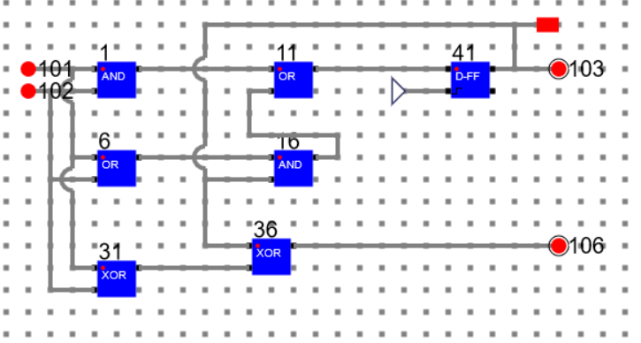
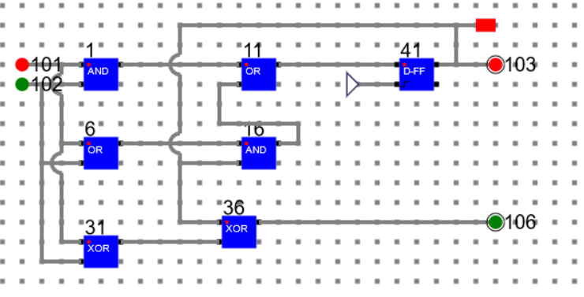
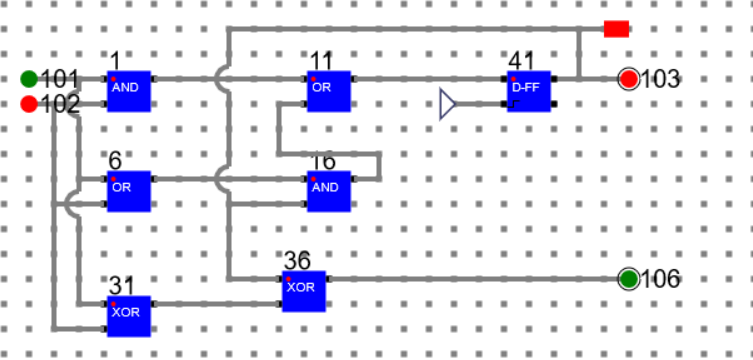
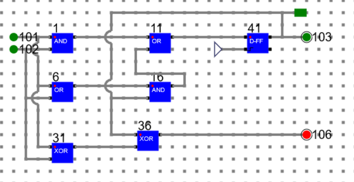
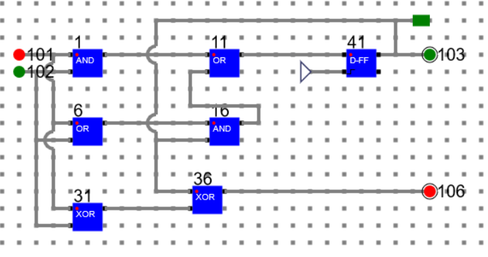
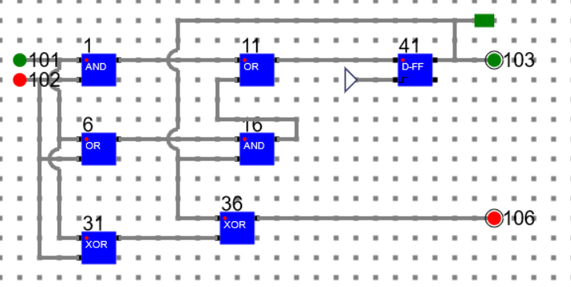
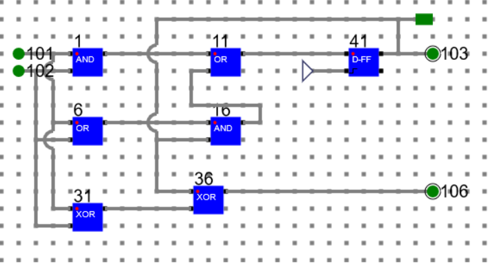
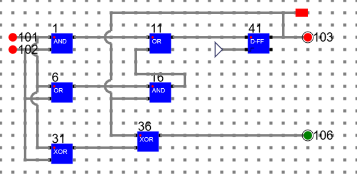

# Procedure

## Simulation of the circuit design in Theory Section

In the circuit:

Input Bits: 101 and 102 

Output Bit: 106

Next State Bit: 103

## Below are the transition and output for Present State: 0 (A)

### Present State: 0, Input 00, Next State: 0, Output: 0

### Present State: 0, Input 01, Next State: 0, Output: 1

### Present State: 0, Input 10, Next State: 0, Output: 1

### Present State: 0, Input 11, Next State: 1, Output: 0

## Below are the transition and output for Present State: 1 (A)

### Present State: 1, Input 01, Next State: 1, Output: 0

### Present State: 1, Input 10, Next State: 1, Output: 0

### Present State: 1, Input 11, Next State: 1, Output: 1

### Present State: 1, Input 00, Next State: 0, Output: 1

# Manual
- Refer the simulator manual on how to design the circuit
    - Manual --> [Click Here](./simulation/coavlNew.pdf)

<embed src="./simulation/coavlNew.pdf" type="application/pdf">

