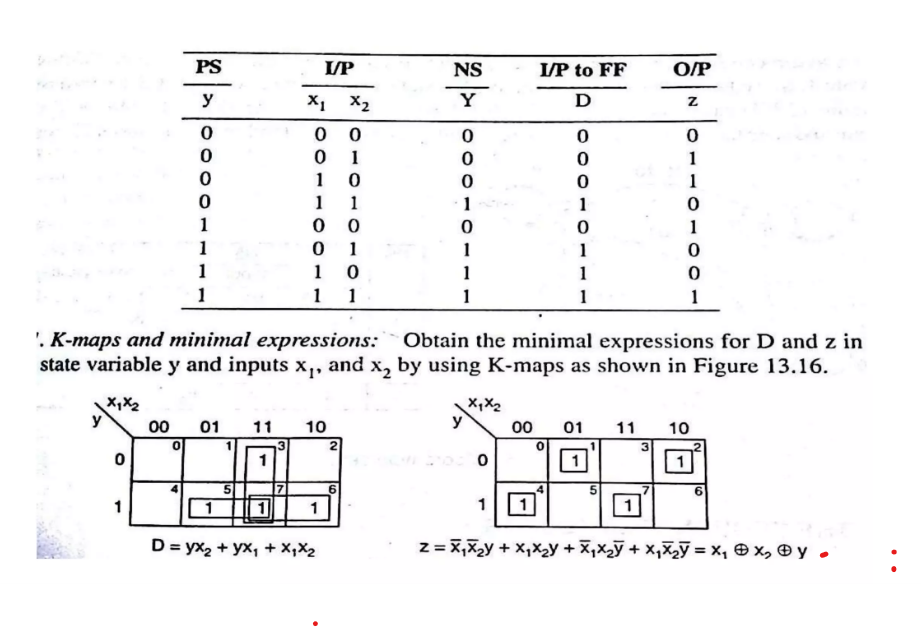
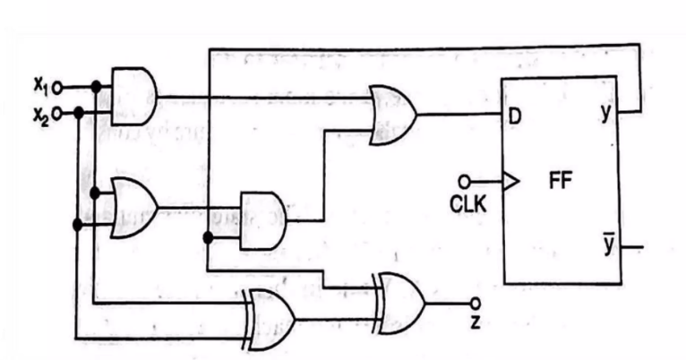

# Theory:

A synchronous Finite State Machine (FSM) is a digital circuit where state transitions are controlled by a central clock signal, occurring only at precise moments like a clock's rising or falling edge. These FSMs use flip-flops to store the current state, and their behaviour is defined by the current state and any new inputs.

### Key characteristics
- **Clock-controlled:**

Transitions between states are synchronized to a global clock signal, ensuring orderly and predictable operation. 

- **Flip-flops:** 

State memory is held in registers (typically flip-flops) that update their values only on the triggering edge of the clock signal. 

### Two types of FSMs:

- ***Moore:*** Outputs are determined solely by the current state. 
- ***Mealy:*** Outputs are determined by both the current state and the current inputs. 

To design a synchronous finite state machine, following steps are followed.

1. Word Statement of The Problem
2. Design State Diagram
3. Design State Table
4. Reduced Standard Form State Table
5. Develop State Assignment, Transition and Output Table
6. Choose Flip-Flop type, form the excitation table
7. Solve k-maps and develop minimal expressions.
8. Implement the expressions.

Here are the steps to build a binary adder using the above steps. [Ref. https://www.slideshare.net/adarshpatel2/synchronous-state-machine-design](https://www.slideshare.net/adarshpatel2/synchronous-state-machine-design)

1. State Diagram & State Table
    

2. Reduced Standard Form State Table

3. Expression reduction using K-maps.

4. Truth table

5. Implementation using D Flip-Flop

