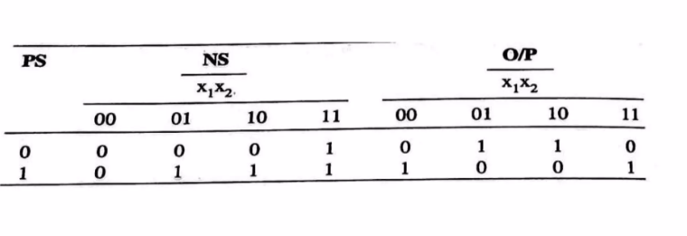
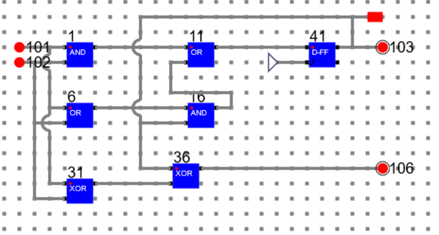
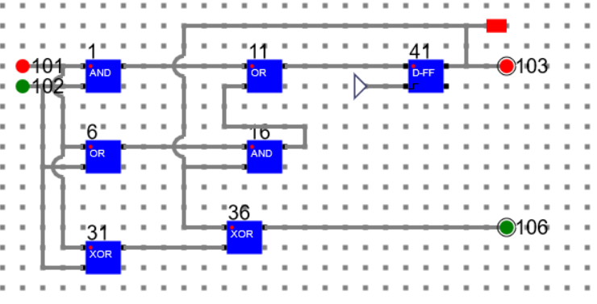
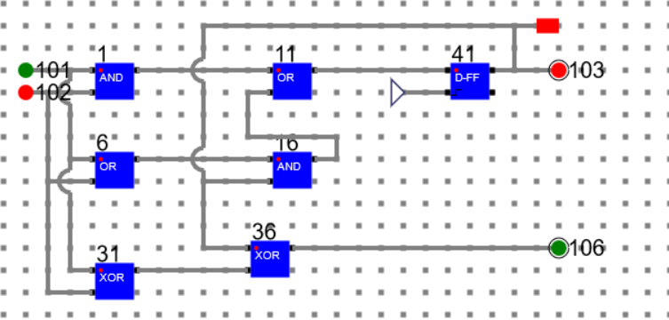
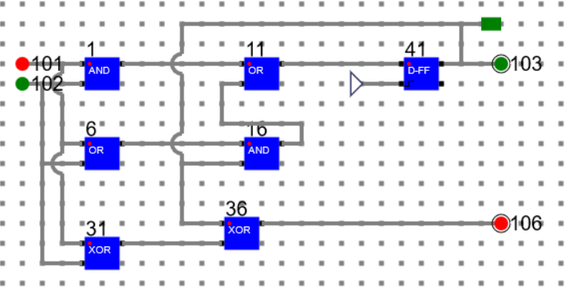
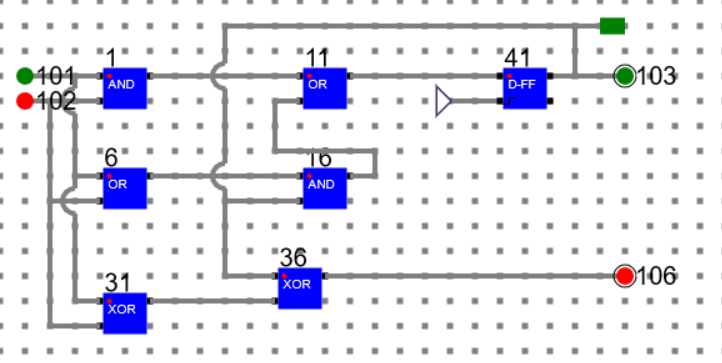
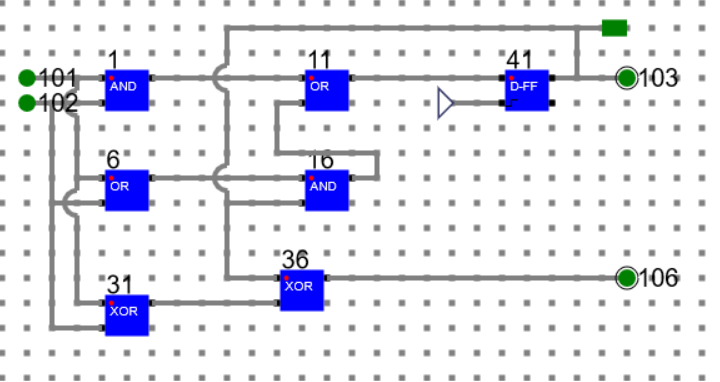
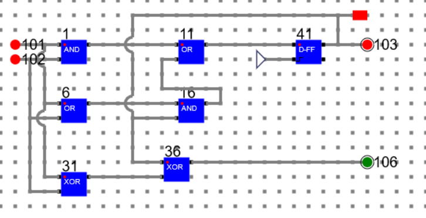

# Theory:

To design a Synchronous finite state machine, following steps are followed.
1. Word Statement of The Problem
2. Design State Diagram
3. Design State Table
4. Reduced Standard Form State Table
5. Develop State Assignment, Transition and Output Table
6. Choose Flip-Flop type, form the excitation table
7. Solve k-maps and develop minimal expressions.
8. Implement the expressions.

Here are the steps to build a binary adder using the above steps. [Ref. https://www.slideshare.net/adarshpatel2/synchronous-state-machine-design](https://www.slideshare.net/adarshpatel2/synchronous-state-machine-design)

1. State Diagram & State Table
    

2. Reduced Standard Form State Table

3. Excitation table with D FlipFlop & Expression reduction using k-maps.

4. Implementation

## Simulation of the above circuit

In the circuit:

Input Bits: 101 and 102 

Output Bit: 106

Next State Bit: 103

## Below are the transition and output for Present State: 0 (A)

### Present State: 0, Input 00, Next State: 0, Output: 0

### Present State: 0, Input 01, Next State: 0, Output: 1

### Present State: 0, Input 10, Next State: 0, Output: 1

### Present State: 0, Input 11, Next State: 1, Output: 0

## Below are the transition and output for Present State: 1 (A)

### Present State: 1, Input 01, Next State: 1, Output: 0

### Present State: 1, Input 10, Next State: 1, Output: 0

### Present State: 1, Input 11, Next State: 1, Output: 1

### Present State: 1, Input 00, Next State: 0, Output: 1

