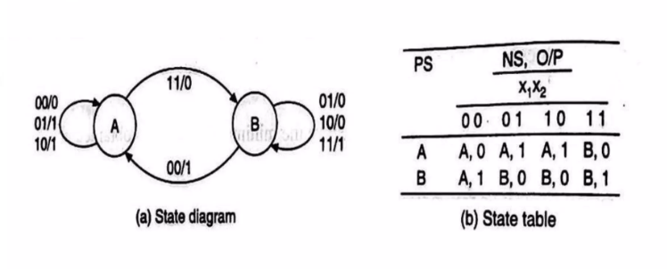
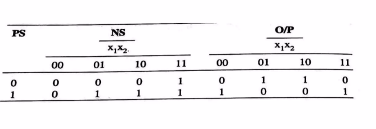
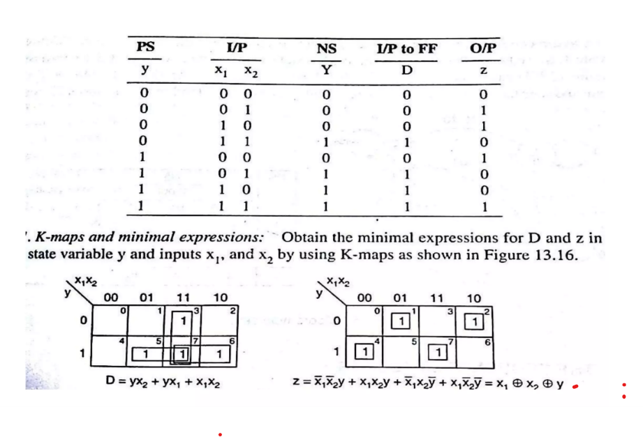
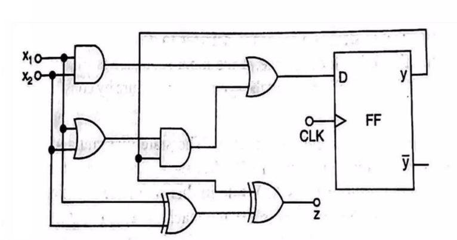

# Theory:

To design a Synchronous finite state machine, following steps are followed.
1. Word Statement of The Problem
2. Design State Diagram
3. Design State Table
4. Reduced Standard Form State Table
5. Develop State Assignment, Transition and Output Table
6. Choose Flip-Flop type, form the excitation table
7. Solve k-maps and develop minimal expressions.
8. Implement the expressions.

Here are the steps to build a binary adder using the above steps. [Ref. https://www.slideshare.net/adarshpatel2/synchronous-state-machine-design](https://www.slideshare.net/adarshpatel2/synchronous-state-machine-design)

1. State Diagram & State Table
    

2. Reduced Standard Form State Table

3. Excitation table with D FlipFlop & Expression reduction using k-maps.

4. Implementation

